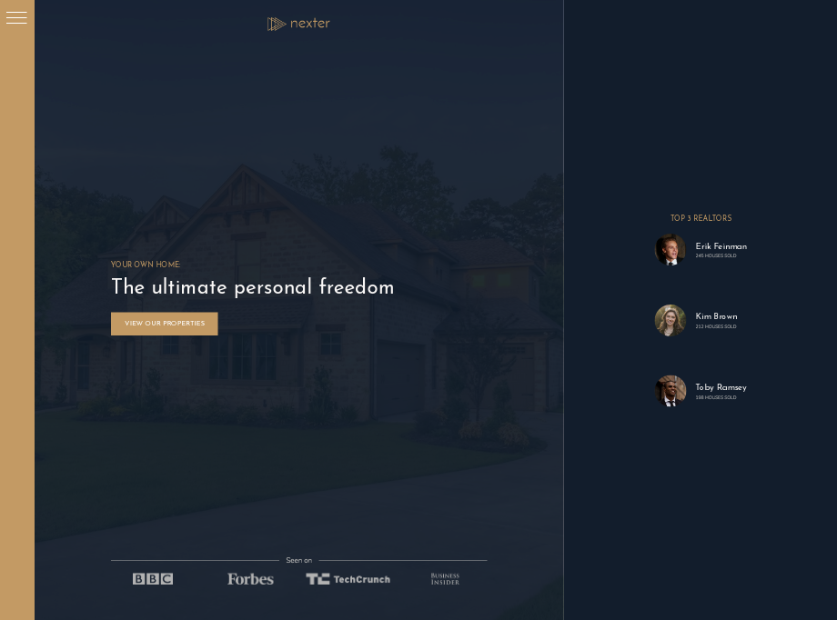
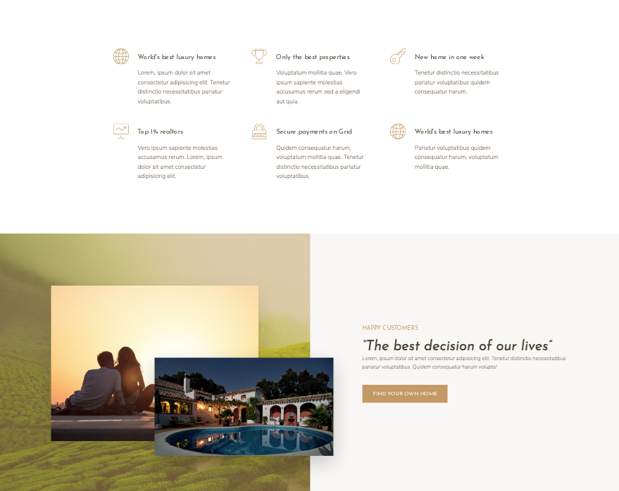
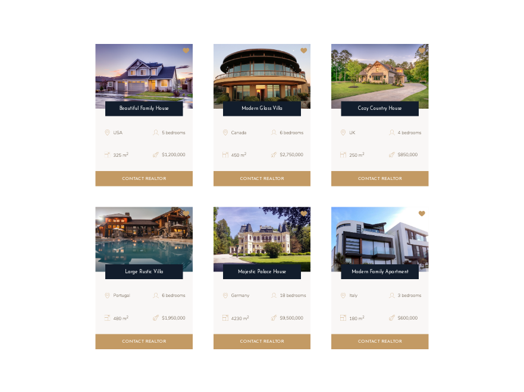
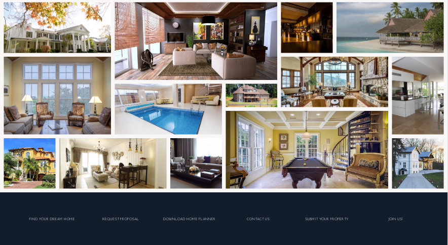

# Nexter Grid Homes Realtors   

### Checkout the Live Version of the [Project](https://dcc5235.github.io/Grid_Homes/)!

**HTML5, CSS3, SCSS**

A responsive, CSS Grids-focused project for a sample luxury homes realtor site. The site includes CSS Grids & Flexbox features for pixel perfect mapping of grids.

---

## Installation & Technologies

- Download the full package, select the Code button, choose the "Download ZIP" option.
- Requires Node.js to run: install [Node.js](https://nodejs.org/en/), current version.
  - <code>npm install</code> to install the Node Sass and libraries, specifically these packages will also be installed.
    - "autoprefixer"
    - "concat"
    - "node-sass"
    - "npm-run-all"
    - "postcss-cli"
  - <code>npm run start</code> to open local server.
- SASS/SCSS: install [Sass](https://sass-lang.com/install), current version.

---

## Project Highlights

Section | Features
------------ | -------------
[Header](#Header) | Vertical spacing in responsive layout with CSS Grid techniques; use of ::before and ::after as grid items.
[Main: Features Section](#Main1) | Overlapping grids, responsive pixel perfect grid mapping, 
[Main: Homes Section](#Main2) | Cards laid out in CSS Grid properties with overlapping gridgs and flexbox features. 
[Main: Gallery](#Main3) | CSS Grid gallery using object-fit together with images for grid items.

## Header

## Main1

## Main2

## Main3

---

## Credits

- Images and design from Jonas Schmedtmann

---

## Contributors

Dany Chheang dany.chheang@gmail.com
